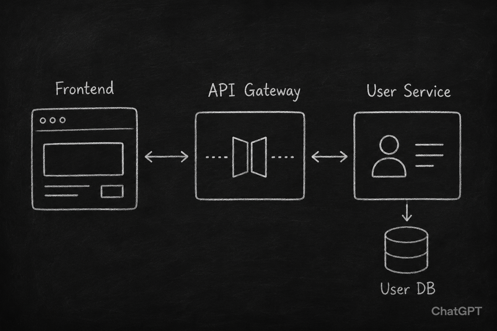

# User authentification on Go

Testing web site written on Go to test authentification. 

## Architecture

Just a simple microservice architecture, that can be seen on that image:

### Frontend 

Just a simple web application

### API Gateway

Authentification and inner API expose

#### Tasks:

- [ ] Run frontend via React + Vite

#### Tasks:

- [ ] Test Redis
- [ ] Test user authorization via JWT tokens
- [ ] CORS support
- [ ] CSRF protection

### User service

User API to manage user profiles. Interacts with the database.

#### Tasks:

- [ ] Test Gin framework
- [ ] Test Swagger

### Database

Just a simple PostgreSQL database.

#### Tasks:

- [ ] Run a simple database
